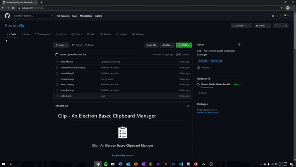
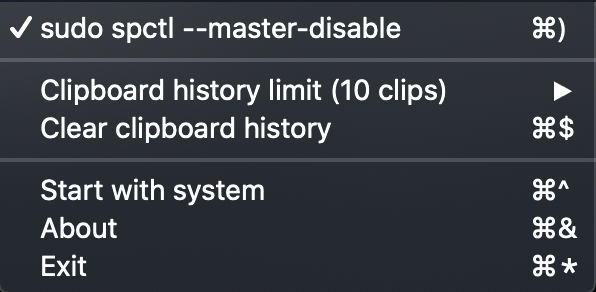
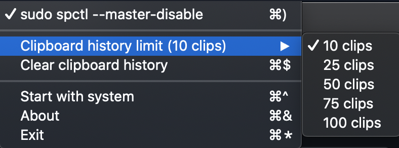
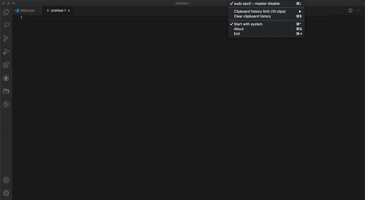

# Clip - An Electron Based Clipboard Manager

<!-- PROJECT LOGO -->
<br />
<p align="center">
  <a href="https://github.com/po1ar/Clip">
    
  </a>

  <h3 align="center">Clip - An Electron Based Clipboard Manager</h3>

  <p align="center">
    <br />
    <a href="https://github.com/po1ar/Clip"><strong>Explore the docs »</strong></a>
    <br />
    <br />
    <a href="https://github.com/po1ar/Clip">View Demo</a>
    ·
    <a href="https://github.com/po1ar/Clip/issues">Report Bug</a>
    ·
    <a href="https://github.com/po1ar/Clip/issues">Request Feature</a>
  </p>
</p>


<!-- ABOUT THE PROJECT -->
## About The Project

Ever wanted to quickly access all of the stuff you've copied? Now you can with Clip. Simply put, you can access up to 100 different things you've copied, in just two clicks.


<!-- GETTING STARTED -->
## Getting Started

This is an example of how you may give instructions on setting up Clip


### Installation

#### Mac
1. Head over [here to install Clip.](https://github.com/po1ar/Clip/releases/)
2. Click the file that corrosponds to your OS and let it download.
3. Head over to Terminal (Click Launchpad (lil rocketship) and then search up Terminal and open it).
4. Enter this command for Mac:
   ```sh
   sudo spctl --master-disable
   ```
   and enter your password
   
4. Open up the file and follow the directions.
5. Clip should be fully installed!


#### Windows 


<!-- USAGE EXAMPLES -->
## Usage

Here's how to use Clip.

## Main Screen

Here you have the main menu for Clip. Let's go over each section.


### Clip History Limit
This section lets you edit up to how many copies it captures.



### Clear Clipboard History
This section lets you clear all of the copies you've made.



<!-- ROADMAP -->
## Roadmap

See the [open issues](https://github.com/po1ar/Clip/issues) for a list of proposed features (and known issues).

<!-- CONTACT -->
## Contact

Your Name - [@polar0101](https://twitter.com/polar0101)

Project Link: [https://github.com/po1ar/Clip](https://github.com/po1ar/Clip)


### Built With

* [Electron](https://www.electronjs.org)
